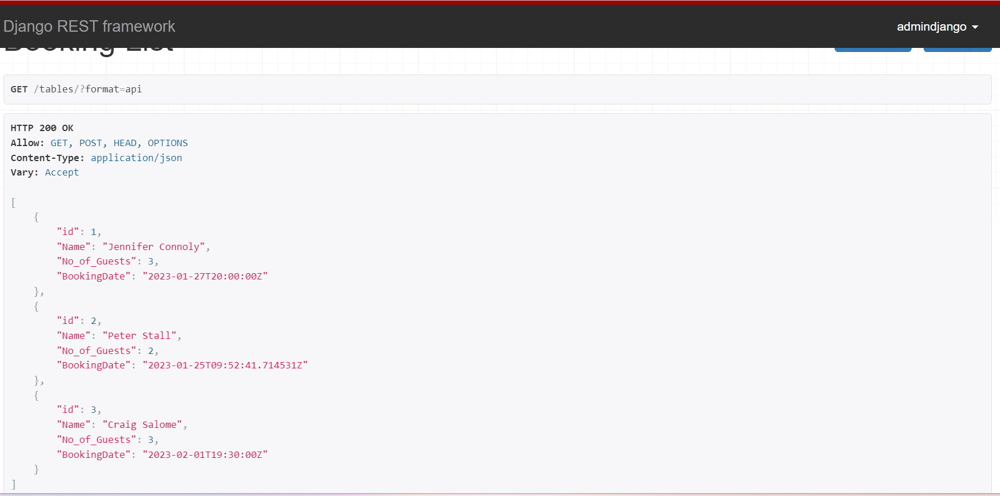
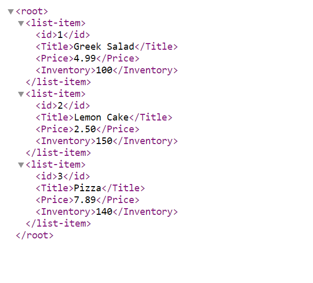

# Backend-Dev-Capstone

## Overview

This is my capstone project of the Meta Back-end developer course. The purpose of the project is to build a RESTful API that allows users of a fictional restaurant to reserve a table from the front-end application of the restaurant.

## Description

This application is a simple REST API that serves as the backend application of a fictional restaurant. It allows different users of the application to do the following:
1.  New customers can register by means of a Post http request.
2.  An authorized manager can see all the registered users of the application via a Get HTTP request.
3.  Any registered user of the app can login and obtain an authorization token or API Key via a Post HTTP request.
4.  An authorized manager can logout a user and destroy their API Key via a Post HTTP request.
5.  Registered customers can make a Get HTTP request for all menu-items the restaurant currently has.
6.  Registered customers can make a Get request for a single menu item.
7.  Authorized managers can make a Post HTTP request to Post new menu-items to the application database.
8.  Authorized managers can make a PUT/PATCH/DELETE HTTP request for a single menu item.
9.  Registerd customers can reserve a table by making a Post request.

This application was built using these technologies and languages:
1.    Django Web Framework
2.    Django REST framework
3.    Python

## API Endpoints
## For models and their views
1. For reserve a table functionality: http://127.0.0.1:8000/tables/
2. Get and Post request for all menu items http://127.0.0.1:8000/restaurant/menu
3. Get/PUT/PATCH/DELETE request for a single menu item http://127.0.0.1:8000/restaurant/menu/1

## For User Registration and authentication
1. GET and Post request for users and to register a new user http://127.0.0.1:8000/auth/users/
2. Post request To Login a user and obtain token http://127.0.0.1:8000/auth/token/login/
3. Post request To Logout user and destroy their token http://127.0.0.1:8000/auth/token/logout/

## API Response
The API response can be in JSON or XML format.

### JSON Format:
 

### XML Format:
 

## Installation
N/A

## Usage
This is a server side application built to be served over a server.

## Credits

Coursera, Meta provided guidiance via the Backend developer specialization.

